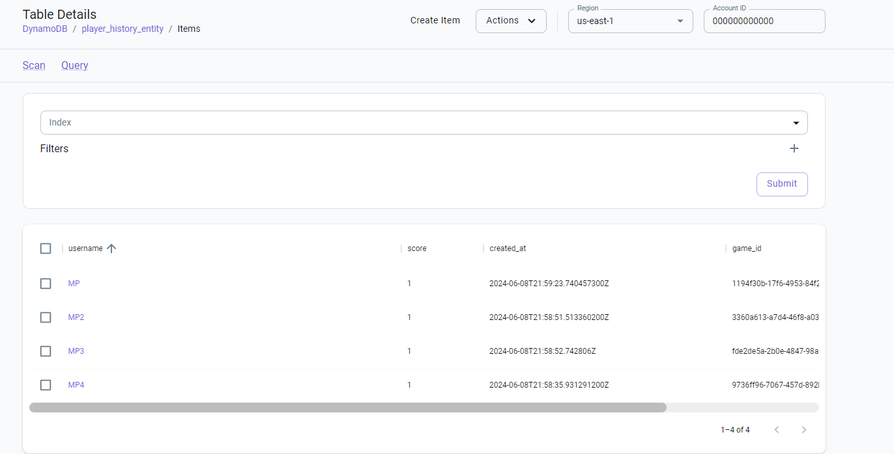

# Java testcontainer com localstack
Exemplo de uso de testcontainer com localstack - dynamoDB

Ao Rodar os testes, deve iniciar o container do localstack e reutiliza-lo para todos os testes.

Resultado da execução dos testes dentro do mesmo container.
https://testcontainers.com/guides/testcontainers-container-lifecycle/#_using_singleton_containers
 ~~~
 The singleton container is started only once when the base class is loaded. 
 The container can then be used by all inheriting test classes. 
 At the end of the test suite the Ryuk container that is started 
 by Testcontainers core will take care of stopping the singleton container.
 ~~~

https://java.testcontainers.org/test_framework_integration/manual_lifecycle_control/#singleton-containers

Também deve esperar a tabela do dynamoDb ser criada antes de executar os testes.
https://java.testcontainers.org/features/startup_and_waits/